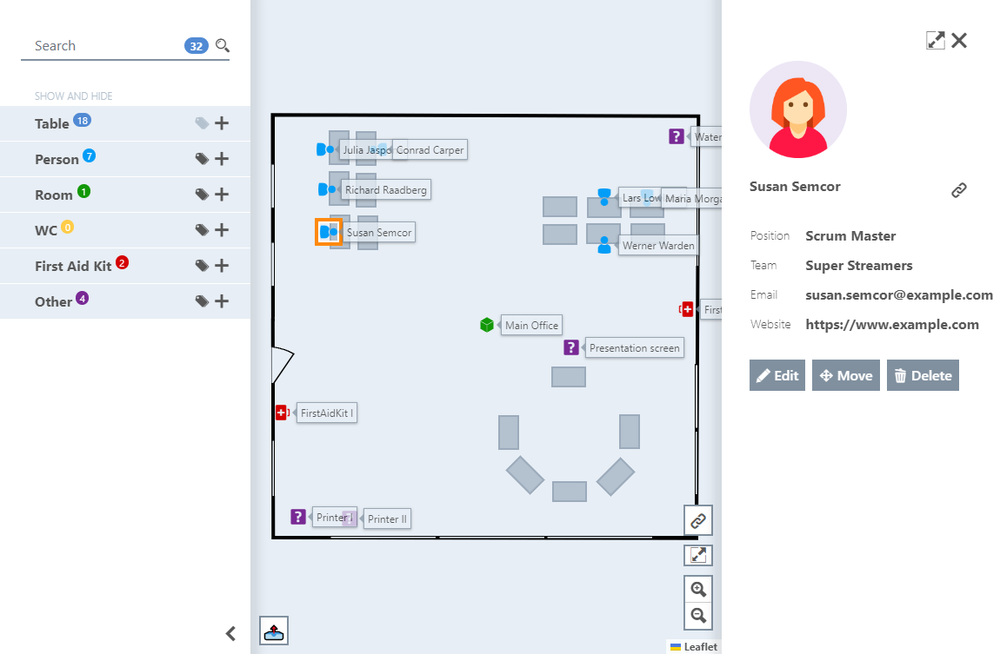

<div align="center">


*"Where's my desk?"* - Search no more:
Manage your floor plan and space layout;
Keep track of item locations;
Collaborate to maximize overview for your office, event location or lecture rooms.
----

</div>

## About Desk Compass

Example screenshot:




### Features

- Display different types of markers, like people, tables, first aid kits a.s.o
- Filter markers via search filter
- Toggle visibility of markers and their labels by type
- Move and rotate markers
- Edit marker properties and upload an image
- `health` and `metrics` endpoints available


## Getting started

### On your local machine

You'll need Node.js >= 18.x and Yarn:

- Run `yarn install` to install all necessary dependencies
- Copy `workspaces/api/local.env` to `workspaces/api/.env`
- Start server and frontend simultaneously with `yarn start`
- See application UI http://localhost:3000/
- See API at http://localhost:3030/api/swagger and as OpenAPI JSON at http://localhost:3030/api/swagger-json
- See health indicator at http://localhost:3030/health
- See application metrics at http://localhost:3033/metrics


### With Docker

```shell
$ docker build -t desk-compass .
$ MSYS_NO_PATHCONV=1 docker run --rm --name=desk-compass -e DATABASE_PATH=/storage/db -e IMAGE_STORAGE_PATH=/storage/images -v "/.tmp/deskcompass:/storage:rw" -p 5000:3030 desk-compass
```
Open http://localhost:5000/ in your browser


**Environment variables:**

- `DEV_MODE`: Should be set to `1` for local development. This will
  - structure and colorize JSON log output
  - enable Swagger UI for API endpoints
- `CORS_ALLOWED_ORIGINS`: comma-separated list of allowed origins (will be parsed as Regex), eg.: `CORS_ALLOWED_ORIGINS="localhost:3000$,127.0.0.1:3000$"`.
- `CORS_ALLOWED_METHODS`: comma-separated list of allowed methods. If not set, it will fallback to `"GET,HEAD,OPTIONS,PUT,POST,DELETE"`
- `DATABASE_PATH` (must): Path to folder to persist application data. Read and write permissions for the application are required.
- `DATABASE_HUMAN_READABLE`: application data is stored in a JSON file. Set this to `true` for readability.
- `IMAGE_STORAGE_PATH` (must): Path to folder to store uploaded images. Read and write permissions for the application are required.
- `METRICS_PORT`: Port for metrics endpoint, defaults to `3033`. This would expose `http://localhost:3033/metrics` for local development.


## Developer guide

Install all necessary dependencies, create basic environment setup for local development and then start application in watch mode:

```shell
yarn install
cp workspaces/api/local.env workspaces/api/.env
yarn start
```
- See application UI http://localhost:3000/
- See API at http://localhost:3030/swagger and as OpenAPI JSON at http://localhost:3030/swagger-json
- See health indicator at http://localhost:3030/health
- See application metrics at http://localhost:3033/metrics


### Run tests

Run frontend and API tests
```shell
yarn run test
```
Run API tests only
```shell
yarn workspace api run test
```

Run frontend tests only
```shell
yarn workspace frontend run test
```

For all calls a `yarn run test:watch` variant exists.


### Run linters

Run frontend and API linters
```shell
yarn run lint
```


## Contributing

### Contributing Guidelines
Read through our [contributing guidelines](CONTRIBUTING.md) to learn about our submission process, coding rules, and more.


### Want to Help?
Want to report a bug, contribute some code, or improve the documentation? Excellent! Read up on our [guidelines for contributing](CONTRIBUTING.md) and then check out one of the project issues labeled as `help wanted` or `good first issue`.


## License

This project is licensed under the MIT License - see the [LICENSE](LICENSE) file for details
